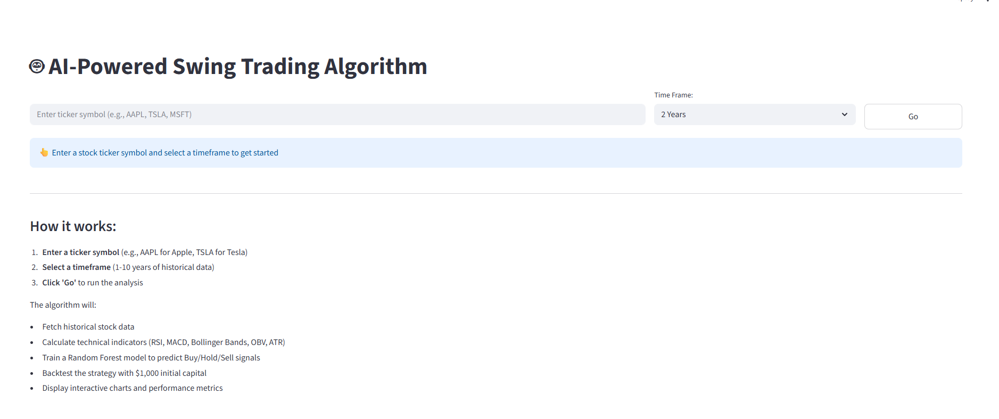
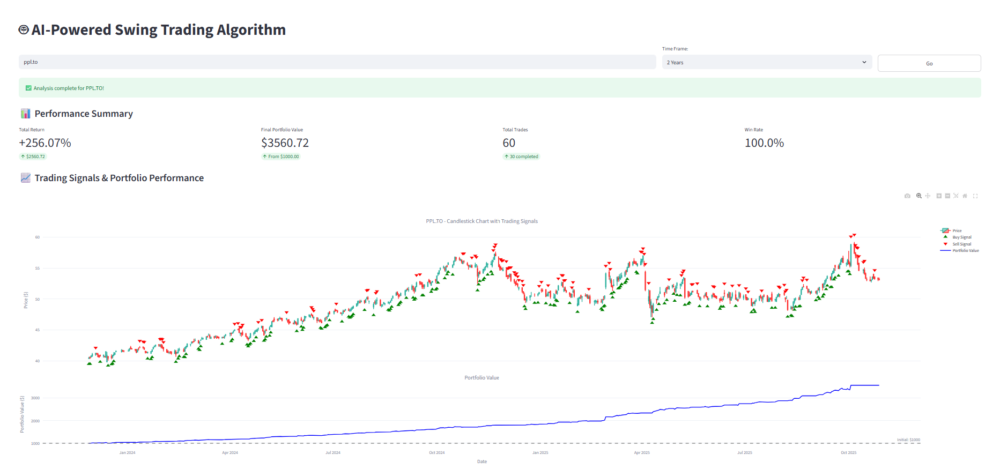
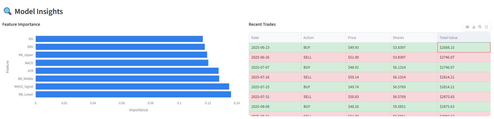

# Alpha.ai - AI-Powered Swing Trading Dashboard

## Created by Ali, Arnav, and Ted for the 2025 Halloween Hackathon

Ali worked on the frontend, Arnav and Ted worked on the backend, and we all worked on integrating the backend into the frontend and documentation.

An intelligent **trading algorithm that uses a machine learning model (Random Forests)** to predict when to buy or sell stocks based on **key statistical indicators**.

**Random Forest** is a powerful ensemble learning algorithm that **builds multiple decision trees**, each trained on random subsets of data and features. The final **prediction is determined by a majority vote across all trees**. In our swing trading project, Random Forest is ideal because it captures complex, nonlinear relationships between multiple technical indicators and future stock price movements—something traditional rule-based systems often miss.

The indicators used were:
- **RSI (Relative Strength Index) and Bollinger Bands**: Identify overbought and oversold conditions.
- **MACD (Moving Average Convergence/Divergence)**: Detects trend direction and potential reversals through EMA (exponential moving average) crossovers.
- **OBV (On-Balance Volume)**: Confirms whether price movements are supported by trading volume.
- **ATR (Average True Range)**: Measures recent volatility to assess risk and can help scale stop-loss levels or filter highly volatile periods.

These indicators were carefully selected because together **they capture the four essential dimensions of market behavior—momentum, trend, volume, and volatility**. This balanced mix provides the model with a holistic view of price dynamics, helping it identify more reliable short-term trading opportunities.

The system is complemented by a modern web interface featuring interactive visualizations that showcase trading signals, indicator trends, and simulated portfolio performance—making complex trading insights intuitive and visually engaging.

## ✨ Features

- 🤖 **AI-Powered Predictions** - Random Forest machine learning model
- 📊 **Interactive Web Dashboard** - Easy-to-use Streamlit interface
- 📈 **Live Charts** - Real-time candlestick charts with buy/sell signals
- 💰 **Backtesting** - See how the strategy performs with $1,000 initial capital
- 📉 **Technical Indicators** - RSI, MACD, Bollinger Bands, OBV, ATR

## ⚠️ Disclaimer

**This project is for educational purposes only.**

The model is trained exclusively on historical data and its performance is evaluated on that same dataset.

**Fine-tuning or optimizing the model for real-world trading scenarios is beyond the scope of this one-day project. The primary goal was to set up the underlying AI-driven infrastructure and demonstrate how machine learning can be applied to trading.**

Important:
Past performance does not guarantee future results. This tool should not be used for live trading without:
- Thorough testing and validation
- Proper risk management
- Consultation with financial professionals

Trading stocks involves risk of loss.

## 📸 Preview

### How It Works
- **Input ticker** - Input the ticker symbol you wish to analyze.
- **Select Timeframe** - Chose the timeframe you wish to run the analysis on and click Go.
- **Fetch Data** - The app retrieves historical stock prices from Yahoo Finance for the chosen ticker and time frame.
- **Compute Indicators** - It calculates RSI, MACD, Bollinger Bands, OBV, and ATR to capture market momentum, trend, volume, and volatility.
- **Train Model** - A Random Forest model is trained on past data to learn when these indicators historically led to a 1% up or down move within 3 days.
- **Predict Signals** - The model predicts Buy or Sell signals for the same dataset.
- **Visualize & Simulate** - Results are plotted on an interactive chart, and a simulated $1000 portfolio shows potential profit or loss based on the model’s strategy.

### Initial Interface

*Clean, intuitive interface with searchable stock ticker dropdown*

### Trading Analysis & Results

*Interactive candlestick charts with buy/sell signals and portfolio performance tracking*

### AI Model Insights

*Feature importance analysis and recent trade history with color-coded buy/sell indicators*

## Libraries and Tools Used
- Cursor - IDE using Sonnet 4.5 and GPT-5 LLMs
- Python 3.8+ - Programming language
- Streamlit - Web interface framework
- Plotly - Interactive charting library
- Pandas - Data manipulation and analysis
- NumPy - Numerical computing
- yfinance - Yahoo Finance API for stock data
- scikit-learn - Machine learning (Random Forest model)
- Matplotlib - Data visualization
- Kaleido - Static image export

## 🚀 Quick Start

### 1️⃣ Install Python
Make sure you have **Python 3.8 or higher** installed. [Download here](https://www.python.org/downloads/) if needed.

### 2️⃣ Set Up Virtual Environment (Recommended)
Open your terminal/command prompt in the project folder:

**Windows:**
```bash
python -m venv .venv
.venv\Scripts\activate
```

**Mac/Linux:**
```bash
python3 -m venv .venv
source .venv/bin/activate
```

You'll see `(.venv)` in your prompt when activated. This keeps project dependencies isolated.

> **Skip this step?** You can, but using a virtual environment prevents package conflicts with other Python projects.

### 3️⃣ Install Dependencies
```bash
pip install -r requirements.txt
```

### 4️⃣ Launch the App
```bash
streamlit run app.py
```

The app will open automatically in your browser at `http://localhost:8501`

---

**Next time:** Just activate the virtual environment (step 2) and run the app (step 4).

## 🎯 How to Use

1. **Select a Stock** - Type or scroll to find a ticker (e.g., AAPL, TSLA, MSFT)
2. **Choose Timeframe** - Select 1, 2, 5, or 10 years of historical data
3. **Click "Go"** - The AI will analyze the stock and show:
   - Trading signals (when to buy/sell)
   - Portfolio performance chart
   - Return percentage and win rate
   - Recent trade history

## 📦 What's Included

- `app.py` - Web interface (Streamlit app)
- `swing_trading_algorithm.py` - Core AI trading algorithm
- `requirements.txt` - Python package dependencies

## 💻 Advanced Usage (Command Line)

You can also run the algorithm directly without the web interface:

```bash
python swing_trading_algorithm.py
```

Or use it in your own Python code:

```python
from swing_trading_algorithm import SwingTradingAlgorithm

# Analyze a stock
algo = SwingTradingAlgorithm(ticker="AAPL", years=2)
results = algo.run()

# Check results
print(f"Total Return: {results['total_return']:.2f}%")
print(f"Win Rate: {results['win_rate']:.2f}%")
```

## 🧠 How It Works

The algorithm follows these steps:

1. **Fetches Stock Data** - Downloads historical price and volume data from Yahoo Finance
2. **Calculates Indicators** - Computes technical indicators (RSI, MACD, Bollinger Bands, OBV, ATR)
3. **Trains AI Model** - Uses machine learning to learn patterns from historical data
4. **Predicts Signals** - Generates buy/sell predictions for each day
5. **Backtests Strategy** - Simulates trading with $1,000 to measure performance
6. **Shows Results** - Displays interactive charts and performance metrics

The AI learns when conditions are favorable to buy (expecting +1% gain) or sell (expecting -1% loss) within the next 3 days.

## 🛠️ Troubleshooting

### Installation Issues
If `pip install -r requirements.txt` fails:

**Windows:**
```bash
py -m pip install -r requirements.txt
```

**Mac/Linux:**
```bash
python3 -m pip install -r requirements.txt
```

### Port Already in Use
If port 8501 is busy, run Streamlit on a different port:
```bash
streamlit run app.py --server.port 8502
```

### No Data Found
Make sure:
- You have an internet connection (needed to fetch stock data)
- The ticker symbol is correct (e.g., "AAPL" not "Apple")
- The stock has sufficient historical data for your chosen timeframe

## 📄 License

This project is provided as-is for educational purposes.